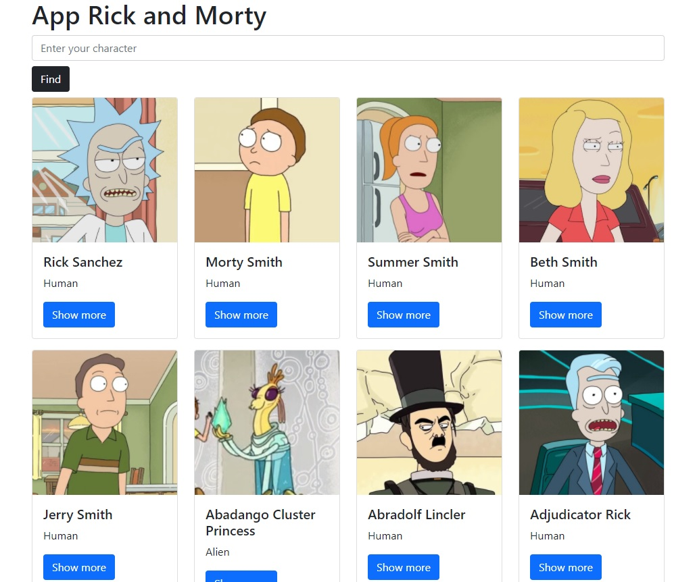
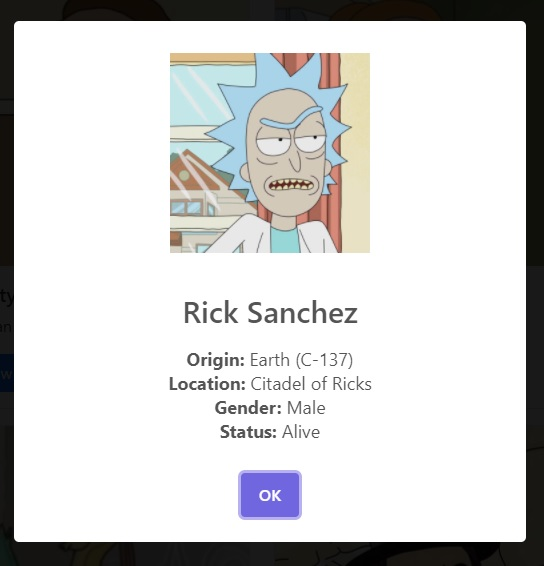
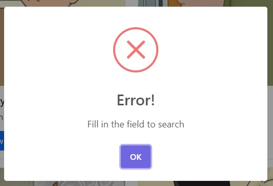

# Rick and Morty App
This project was create with [ReactJS](https://reactjs.org/) by the using of hooks.
The project aims to search for characters from the serie `Rick and Morty`. And if it's necessary, to show more detailed information about the selected character through a modal.

## Library
The library I used was:

### [Sweet Alert 2](https://sweetalert2.github.io/)
With this library I generated the error messages and the "show more" to expand the information of each character.

Show More:

Error:

### [Bootstrap 5](https://getbootstrap.com/)
To make the layout of the application I used `Bootstrap 5`, both for the form and also the cards of each successful search that is made.

## Hooks
The hooks used were `useState`, `useEffect` and a custom hook called `useForm`.

### `useForm`
This hook was reused from another project. It has the function of obtaining the input of the form. It also has a method to reset the input.

## Website
You can find this website hosted at: [https://rickandmorty-cristiannd.netlify.app/]